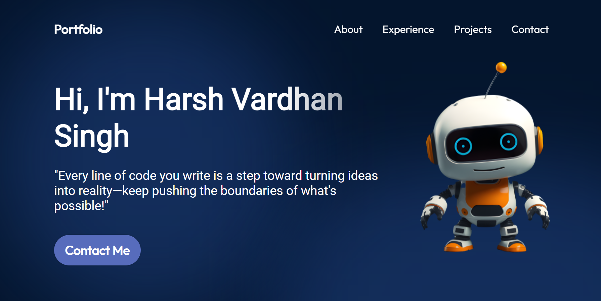
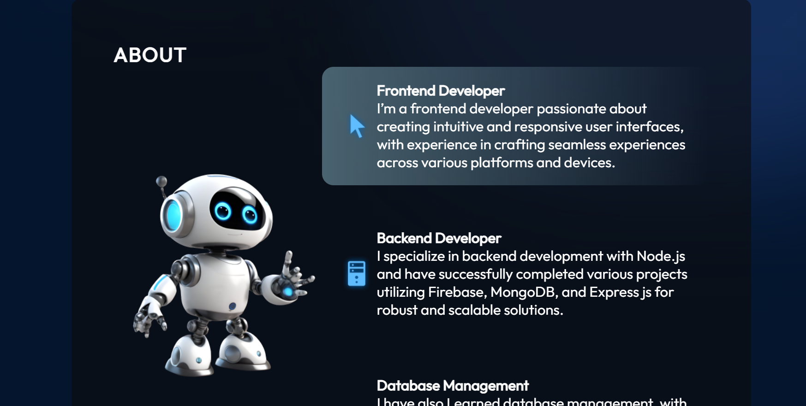
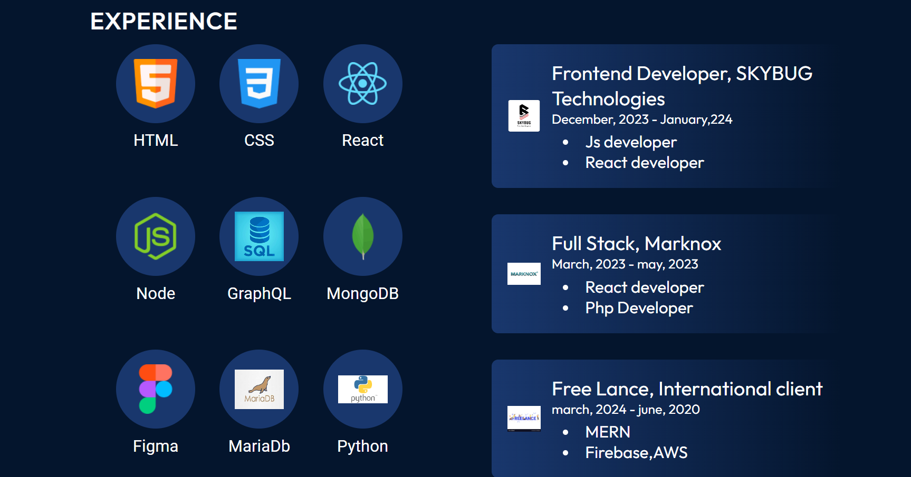

# My Portfolio

Welcome to my portfolio! This is a React-based web application showcasing my projects, skills, and experience. Feel free to explore and get to know more about my work and achievements.

## Table of Contents

- [Introduction](#introduction)
- [Features](#features)
- [Technologies](#technologies)
- [Installation](#installation)
- [Usage](#usage)
- [Project Structure](#project-structure)
- [Contributing](#contributing)
- [License](#license)
- [Contact](#contact)
- [Images](#Photos)

## Introduction

This portfolio is a dynamic, interactive website built with React. It highlights my professional experience, key projects, and skills. The site is designed to be responsive and user-friendly, ensuring a seamless experience across different devices.

## Features

- **Home Page**: An overview of who I am and a summary of my professional journey.
- **Projects Section**: Detailed descriptions of various projects Ive worked on, including live links and code repositories.
- **Experience Section**: A timeline of my career history and significant accomplishments.
- **Skills Section**: A showcase of my technical skills and proficiencies.
- **Contact Form**: A way for potential employers or collaborators to get in touch with me.

## Technologies

- **React**: For building the user interface.
- **React Router**: For handling navigation between different sections.
- **CSS Modules / Styled Components**: For styling the components.
- **Axios**: For making HTTP requests (if applicable).
- **React Hook Form**: For managing form state and validation (if applicable).

## Installation

To run this project locally, follow these steps:

1. **Clone the repository:**

   ```bash
   git clone gh repo clone harshvardhan119/ReactPortfolio


## Photos



